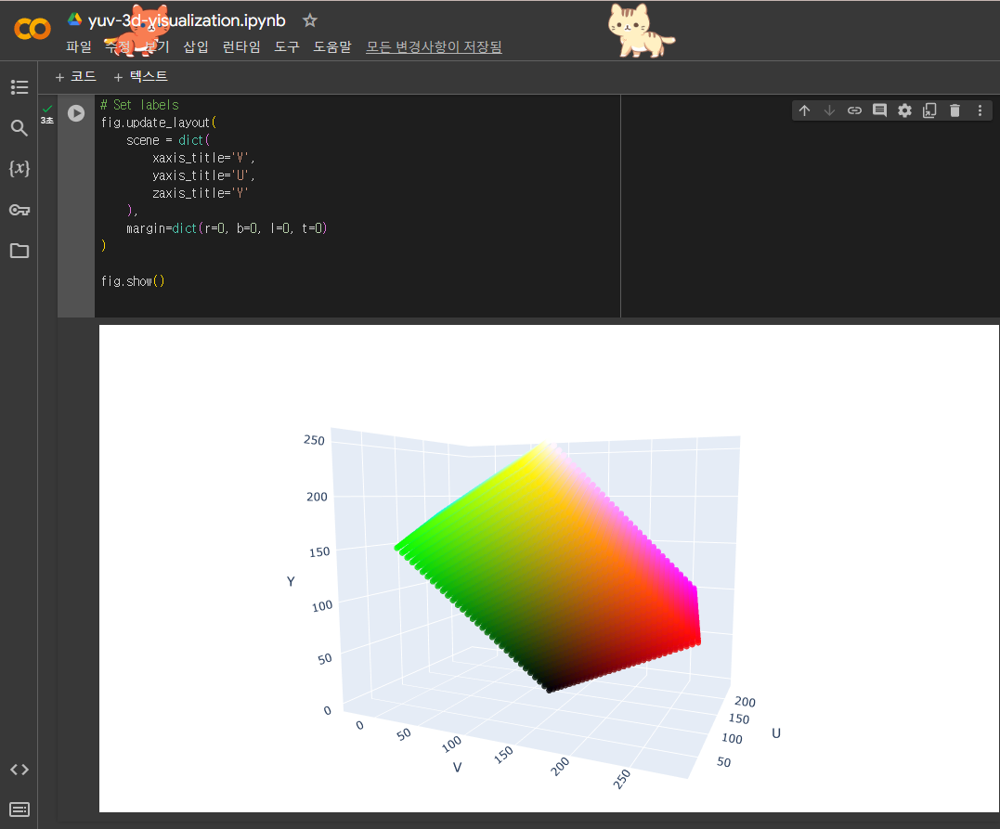
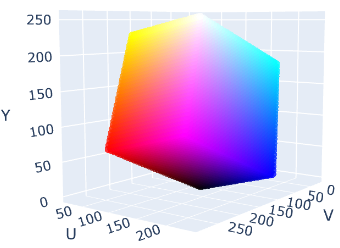
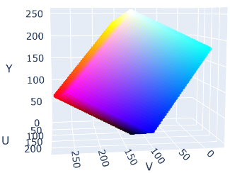
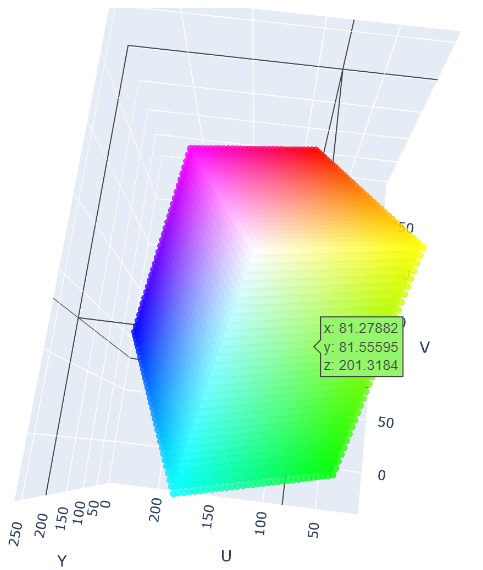

# Color-Space-3D-Visualization
Visualize the Color Space in 3D using Plotly on [Google Colab](https://colab.research.google.com/drive/15oyszKCTJ1wtVt1y0fqYfRHIYtyvYWoM?usp=sharing).

```bash
 !pip install plotly
```

```python
import plotly.graph_objects as go
import numpy as np

# Define RGB values
resolution = 32
rgb_range = np.linspace(0, 255, resolution, dtype=float)
mesh_r, mesh_g, mesh_b = np.meshgrid(rgb_range, rgb_range, rgb_range, indexing='ij')

# Convert RGB to YUV, see https://stackoverflow.com/questions/2905597/how-to-deal-with-rgb-to-yuv-conversion for reference
y = 0.299 * mesh_r + 0.587 * mesh_g + 0.114 * mesh_b
u = 128 - 0.168736 * mesh_r - 0.331264 * mesh_g + 0.5 * mesh_b
v = 128 + 0.5 * mesh_r - 0.418688 * mesh_g - 0.081312 * mesh_b

# Set color of each point based on its RGB value
colors = np.stack([mesh_r, mesh_g, mesh_b], axis=-1)
colors = colors.reshape(-1, 3)

# Create Plotly 3D scatter plot
fig = go.Figure(data=[go.Scatter3d(
    x=y.flatten(),
    y=u.flatten(),
    z=v.flatten(),
    mode='markers',
    marker=dict(
        size=2,  # Adjust marker size
        color=['rgb({},{},{})'.format(r,g,b) for r,g,b in colors],  # Set color based on RGB values
        opacity=0.8
    )
)])

# Set labels
fig.update_layout(
    scene = dict(
        xaxis_title='Y',
        yaxis_title='U',
        zaxis_title='V'
    ),
    margin=dict(r=0, b=0, l=0, t=0)  # Adjust margins
)

fig.show()
```




Experience 3D!








## Credits
This project was generated with the assistance of ChatGPT-4, an advanced language model developed by OpenAI. The tool's concept, code snippets, and documentation were crafted through interactive sessions with the AI, showcasing the potential of AI-assisted software development.
